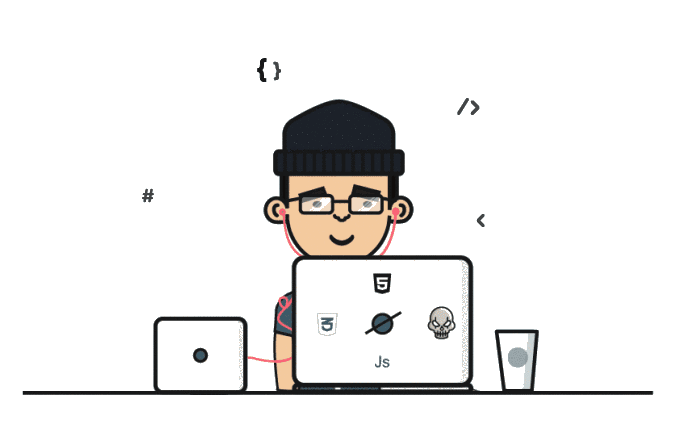

  

###

  
  
  
  

###

  

###

<h1 align="center">Hey 👋 What's up?</h1>

###

<h2 align="left">About me</h2>

###

My name is nirav and I am a web developer with a passion for creating beautiful and user-friendly websites. I have over 2 years of experience in the industry, and I am proficient in a variety of technologies, including HTML/CSS, JavaScript, Nodejs, Reactjs and Nextjs.   - 🔭 I’m working as web developer 🧑‍💻 - 📚 I'm currently learning python 🐍 - ⚡ In my free time i play games 🎮

###

<h2 align="left">🛠 Language and tools</h2>

###

  
  
  
  
  
  
  
  
  
  
  
  
  
  
  
  
  
  
  
  
  
  
  

###
